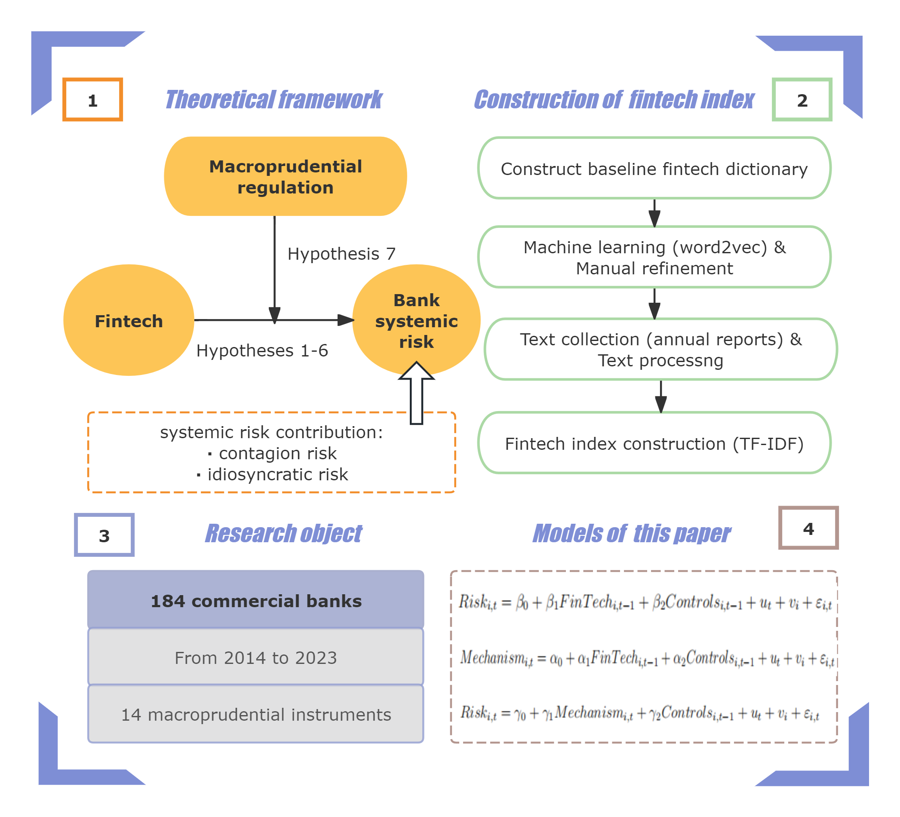

## Abstract

This paper examines how FinTech development affects banks’ systemic risk and the effectiveness of macroprudential regulation. Our analysis uses panel data on 184 Chinese commercial banks from 2014 to 2023. We construct a novel FinTech index using a machine-learning-based text-mining approach. We find that FinTech lowers idiosyncratic risk but amplifies contagion risk, thereby increasing systemic risk contribution. Mechanism analysis shows that FinTech raises contagion risk through interbank linkages, while it reduces idiosyncratic risk through lower credit risk and improved management efficiency. Heterogeneity analysis reveals that bank soundness, regional digital finance development, and FinTech sub-indices generate heterogeneous effects. Finally, we show that macroprudential policies are only partially effective: they mitigate idiosyncratic risk but fail to contain contagion risk, creating new challenges in the FinTech era. These findings provide theoretical and policy implications for fostering FinTech while safeguarding systemic stability in the banking system.

## Important Figure

::: {layout-ncol="1"}

{fig-align="center" width="80%"}

:::

## BibTeX citation

```bibtex
@misc{
  title   = {Idiosyncratic Risk Down, Contagion Risk Up: FinTech and Macroprudential Limits},
  author  = {Liu, Yangjingzhuo and Liang, Shuang},
  year    = {2025},
  publisher = {Social Science Research Network},
  doi     = {10.2139/ssrn.5554649},
}

```