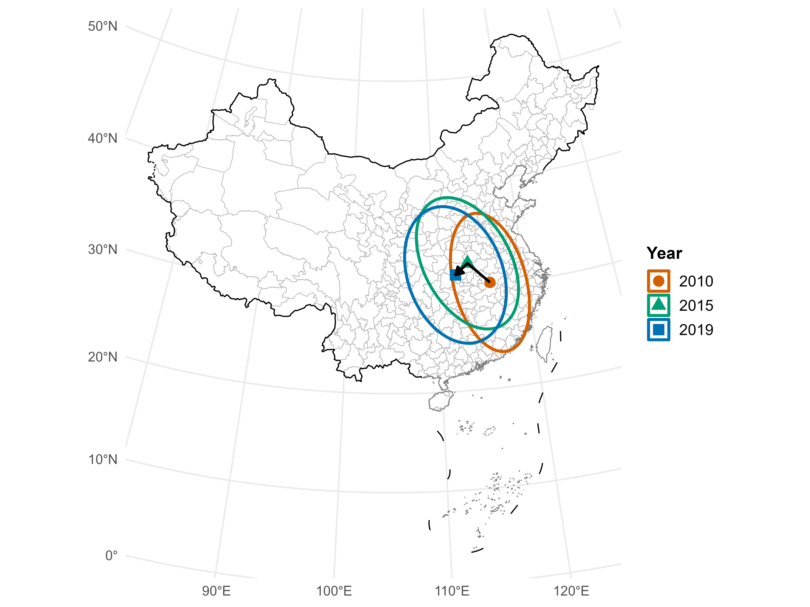

## Abstract

Industry transfer is often seen as a barrier to urban green growth. Using city-level panel data from China, this study shows that policy-led strategic emerging industry (SEI) transfer can foster sustainable urban development. Spatial Durbin and partially linear functional-coefficient models are employed to assess spillovers and threshold effects. We find that SEI transfer promotes green growth through industrial upgrading and green innovation. The effects are asymmetric but positive for both inflows and outflows, with clear cross-city spillovers. Environmental regulation moderates the impact in an inverted U-shaped pattern, while green policy support serves as a substitute. These results support the positive-sum Transfer Halo Hypothesis and provide guidance for industrial relocation policies that promote long-term sustainable growth.

## Important Figure

::: {layout-ncol="1"}

{fig-align="center" width="80%"}

:::