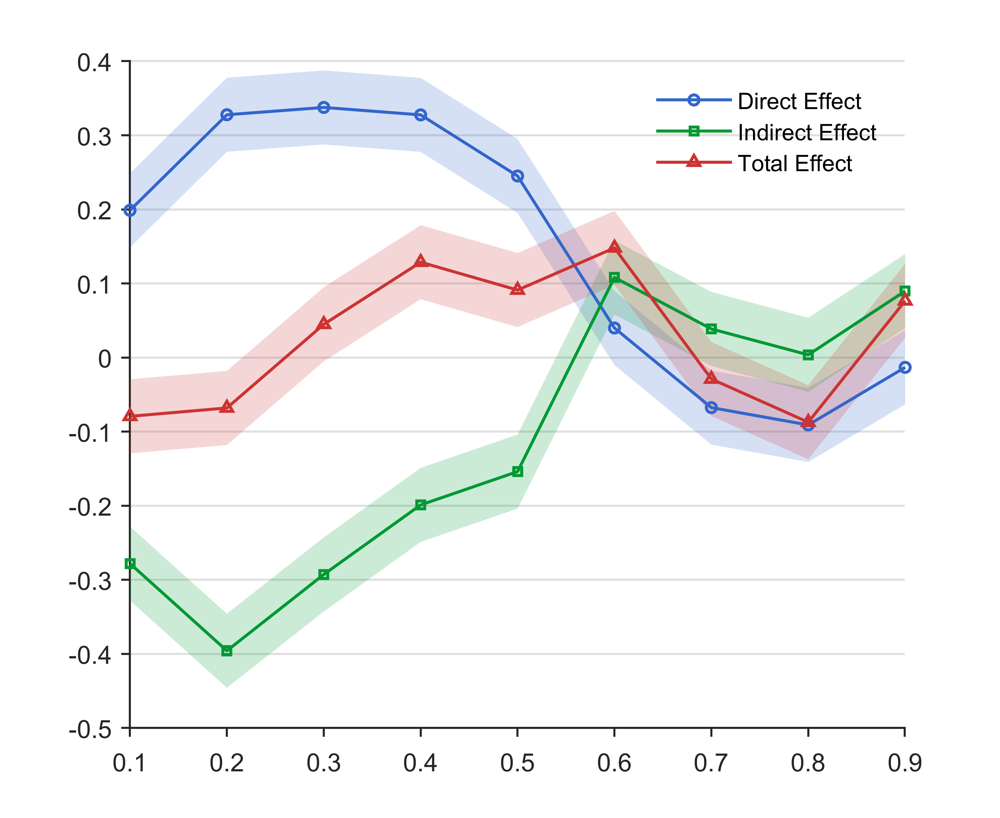
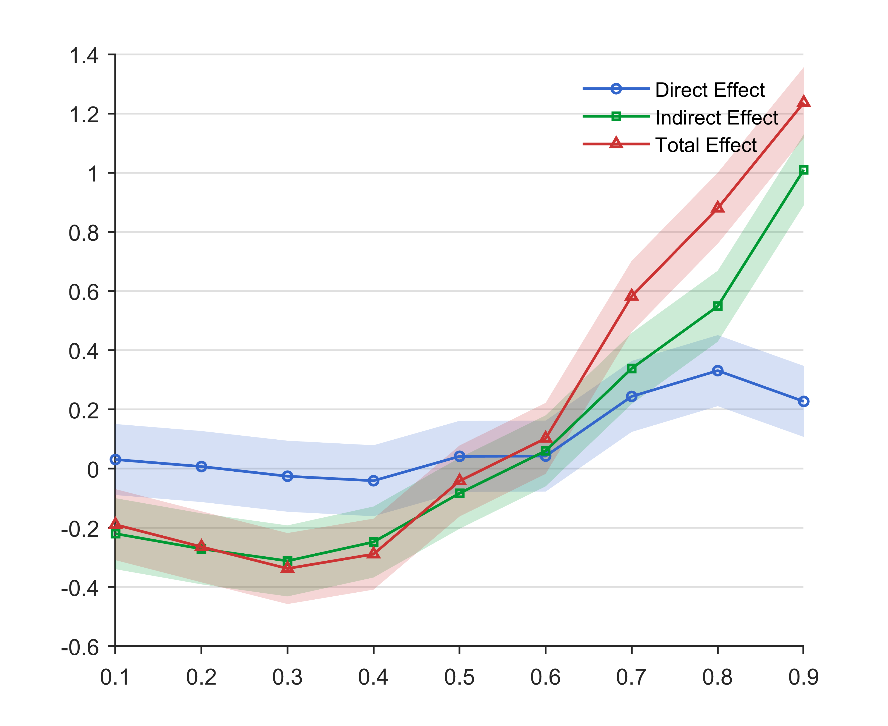

## Abstract

Urban--rural disparities constitute a persistent challenge in economic development. This study examines China's Rural Collective Property Rights (RCPR) reform as an institutional shock affecting collective membership and asset governance. Using a balanced panel of 283 prefecture-level cities (2012--2022) and a Spatial Durbin difference-in-differences design, we demonstrate that the reform increases urban--rural integration (URI) locally while generating spatial spillovers. Dynamic estimates reveal strengthened local effects and delayed diffusion. Mechanisms align with a Coasean channel (accelerating land transfers) and a club-goods channel (increasing rural income). The reform may simultaneously exacerbate capital misallocation. Effects follow a hump-shaped pattern relative to government intervention, with stronger impacts where collective economies are larger. Situated at the intersection of New Institutional and Public Economics, this study provides spatial--institutional evidence for membership-based property rights fostering URI.

## Important Figure

::: {layout-ncol="2"}

:::